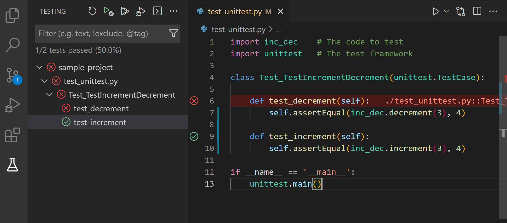

Unit Testing
============

Tests are an essential part of good software. They ensure that your
implementation does what it is supposed to do. They are also invaluable
when making changes to existing code to see whether things break
unexpectedly. Whenever you contribute code to ProbNum, make sure it is
covered by appropriate tests.

If you’re unsure of what tests are or have never written a test before,
check out this `basic guide <https://realpython.com/python-testing/>`__
on testing in Python.

Running Tests
-------------

ProbNum’s tests can be found in the folder ``./tests``. To run the
entire test suite, we recommend using ``tox``.

Tox
~~~

To run the tests using Tox, simply execute

.. code:: bash

   tox -e py3

This runs the tests for your version of Python 3. You can also run the
tests against a specific Python version, e.g. ``tox -e py38`` for Python
3.8.

For more information on ``tox``, check out the `general development
instructions <../development/pull_request.md>`__.

PyTest
~~~~~~

ProbNum uses ``pytest`` as a test runner. You can also run the tests
directly by installing (``pip install pytest``) and executing

.. code:: bash

   pytest

in the ``./tests`` directory.

Using an IDE
~~~~~~~~~~~~

If you are using an IDE such as PyCharm or VSCode, you can for example
use the graphic interface to run single tests. This can be very
convenient when writing tests. To set up your IDE to run ``pytest``,
check out the following guides:

-  PyCharm: https://www.jetbrains.com/help/pycharm/pytest.html
-  VSCode:
   https://code.visualstudio.com/docs/python/testing#_enable-a-test-framework

.. code:: ipython3

    from IPython.display import Image
    
    display(Image(url='https://code.visualstudio.com/assets/docs/python/testing/test-results.png', embed=True))

The ``pytest`` Framework
------------------------

ProbNum uses `pytest <https://docs.pytest.org/>`__ as its testing
framework.

Writing a Unit Test
~~~~~~~~~~~~~~~~~~~

A test is a simple function which checks whether your code does what it
is supposed to. Whenever you find yourself running a snippet of code to
check whether your implementation works, you should probably write a
test. Here is a simple example.

.. code:: ipython3

    def add(x, y):
        return x + y
    
    def test_symmetric():
        assert add(3, 5) == add(5, 3)

Often we want to run a test for different combinations of parameters.
You can do so by parametrizing tests via a decorator.

.. code:: ipython3

    import pytest
    
    @pytest.mark.parametrize("x,y", [(3, 5), (-1, 1), (0, 1.2)])
    def test_symmetric(x, y):
        assert add(x, y) == add(y, x)

Read more about test parametrization and fixtures
`here <https://docs.pytest%20.org/en/stable/parametrize.html>`__.

NumPy Assertions
~~~~~~~~~~~~~~~~

Often assertions which compare arrays are needed for tests. The module
`numpy
.testing <https://numpy.org/doc/stable/reference/routines.testing.html>`__
offers support for commonly used tests involving numeric arrays, such as
comparison of all elements up to a certain tolerance.

Common Types of Tests
---------------------

We collect some common types of tests here, in particular for
probabilistic numerical methods.

In- and Output
~~~~~~~~~~~~~~

-  **Deterministic input**: Does your PN method accept parameters /
   problem definitions which are not random variables?
-  **Output Random Variables**: Does your PN method output a random
   variable?
-  **Shape**: Does your method return consistent shapes for differently
   shaped inputs?
-  **Expected errors**: Are appropriate errors raised for invalid input?
   Do these match the ``Raises`` keyword in the docstring?
-  **Random state**: Does fixing a random seed result in deterministic
   behaviour?

Testing Probabilistic Numerical Methods
~~~~~~~~~~~~~~~~~~~~~~~~~~~~~~~~~~~~~~~

-  **Perfect information**: Does your method converge instantly for a
   prior encoding the solution of the problem?
-  **Convergence criteria**: Are all convergence criteria covered by at
   least one test?
-  **Theoretical Results**: Are all available theoretical results about
   the method checked via tests?
